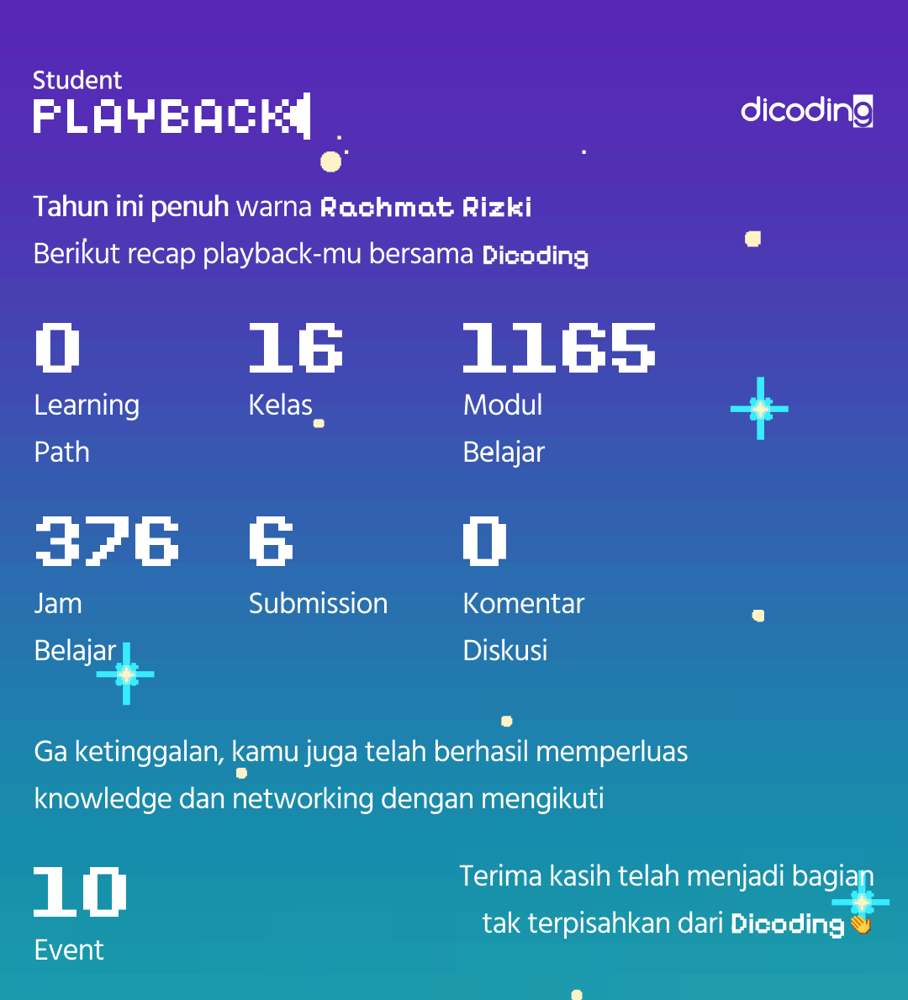

# Kegiatan-beasiswa
Kegiatan kelas beasiswa yang diikuti secara gratis
* Sponsorship : Dicoding X GDSC Universitas Diponegoro - Belajar Dasar Pemrograman Web - Selesai pada 30 Januari 2023 (Self Paced)
* DBS Foundation Coding Camp 2023 - (25 Januari - 30 Juni 2023) - Kelas Back-End Developer - Selesai pada 12 Februari 2023 (Self Paced)
* Dicoding for University Batch 2 - (24 Agustus - 23 Oktober 2023) - Selesai pada 18 September 2023 (Self Paced)
* Lintasarta Cloudeka Digischool 2023 - (24 November - 31 Desember 2023) - Selesai pada 17 Desember 2023 (Self Paced) 
* DBS Foundation Coding Camp 2024 - (23 Januari - 25 Juni 2024) - Kelas Front-End Developer - Selesai pada 7 Februari 2024 (Self Paced)
  
# Student Playback (Dicoding)

